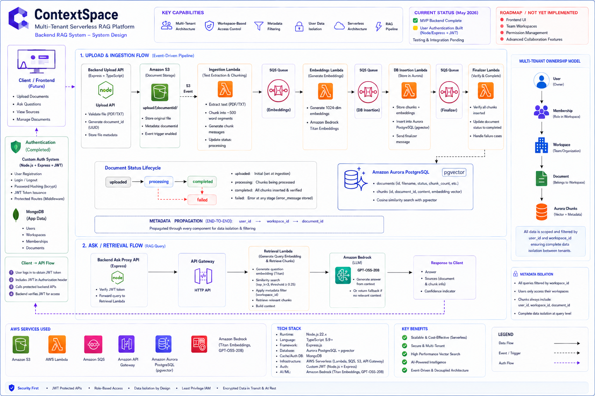

# ContextSpace

**Multi-Tenant Serverless RAG Platform**

[](https://aws.amazon.com/)
[](https://www.typescriptlang.org/)
[](https://nodejs.org/)
[](https://www.mongodb.com/)
[](https://www.postgresql.org/)

## 📋 Overview

**ContextSpace** is a production-grade, multi-tenant serverless RAG platform for secure document processing and AI-powered question answering. Built entirely on AWS serverless infrastructure, it demonstrates enterprise backend patterns including:

- **Custom JWT Authentication** with OTP email verification
- **Multi-tenant Workspace Architecture** with strict data isolation
- **Event-driven Serverless Pipeline** (S3 → Lambda → SQS → Aurora)
- **Metadata-filtered Vector Search** ensuring cross-user security
- **Infrastructure as Code** using AWS CDK

This project showcases real-world distributed systems design, ownership-based access control, and production-ready serverless backend engineering.

---

## 🏗️ Architecture



### Upload Pipeline

```
User → Express API (JWT Auth)
└─▶ S3 (metadata: user_id, workspace_id, document_id)
└─▶ Ingestion Lambda (text extraction, chunking)
└─▶ SQS → Embeddings Lambda (Bedrock Titan 1024-dim)
└─▶ SQS → DB Insertion Lambda (Aurora pgvector)
└─▶ SQS → Finalizer Lambda (verify completion)
```

### Question Answering Pipeline

```
User → Express API (JWT Auth)
└─▶ API Gateway → Retrieval Lambda
├─ Generate embedding (Bedrock Titan)
├─ Similarity search (pgvector, filtered by user_id + workspace_id)
└─▶ Bedrock GPT-OSS-20B (context-aware answer generation)
```

**Key Design**: Ownership metadata (\`user_id\`, \`workspace_id\`, \`document_id\`) propagates through every stage—S3 metadata → SQS messages → PostgreSQL rows → retrieval WHERE clauses—ensuring multi-tenant isolation.

---

## 🚀 Key Features

### ✅ Completed

**Authentication & Multi-Tenancy**

- Custom JWT authentication (HTTP-only cookies, no refresh tokens)
- OTP email verification via Resend
- User/Workspace/Membership models with MongoDB transactions
- Automatic personal workspace creation on verification
- Role-based access control (owner/admin/member)

**Document Processing**

- Protected upload API (PDF/TXT, max 10MB)
- S3 event-driven ingestion (text extraction, chunking ~500 words)
- Amazon Bedrock Titan embeddings (1024-dim vectors)
- Aurora PostgreSQL with pgvector storage
- 4-stage Lambda pipeline with SQS queues
- Document status tracking (processing → completed/failed)
- Finalizer verification pattern (ensures all chunks inserted)

**AI Question Answering**

- Metadata-filtered vector retrieval (workspace + user isolation)
- Cosine similarity search (top-k=3, threshold ≥0.25)
- Context-aware answer generation (Bedrock GPT-OSS-20B)
- Source citation with similarity scores

**Infrastructure**

- AWS CDK (TypeScript) for full IaC
- VPC with private subnets + VPC endpoints (Secrets Manager, Bedrock, SQS)
- Aurora PostgreSQL Serverless v2 with pgvector
- API Gateway REST integration
- Security: Helmet, CORS, rate limiting, input validation (Zod)

### 🔮 Roadmap

- Document status polling API
- Document deletion with cascade
- Retry failed document processing
- Team workspace management + invitations
- Granular permission system
- Frontend UI

---

## 🛠️ Tech Stack

**Backend**: Node.js 22, Express, TypeScript 6, JWT, bcryptjs, Zod, Mongoose, Winston  
**Lambdas**: Node.js + TypeScript, esbuild bundled, pdf-parse, node-postgres  
**Infrastructure**: AWS CDK 2.232+ (TypeScript 5.9)  
**Databases**: MongoDB Atlas (users/workspaces/memberships), Aurora PostgreSQL 16 Serverless (documents/chunks/pgvector)  
**AWS**: Lambda, S3, SQS, Bedrock (Titan Embeddings, GPT-OSS-20B), API Gateway, VPC, Secrets Manager, IAM

---

## 📂 Project Structure

```
context-space/
│
├── backend/                    # Express API server (Node.js + TypeScript)
│   ├── src/
│   │   ├── modules/
│   │   │   ├── auth/          # Authentication routes + controllers
│   │   │   └── document/      # Document upload + ask endpoints
│   │   ├── models/            # MongoDB schemas (User, Workspace, Membership)
│   │   ├── middlewares/       # JWT protection, error handling
│   │   ├── services/          # S3, email, auth business logic
│   │   └── config/            # Environment validation, DB connection
│   └── package.json
│
├── lambdas/                    # AWS Lambda handlers (serverless functions)
│   ├── src/
│   │   ├── ingestion-handler/         # PDF/TXT extraction + chunking
│   │   ├── embeddings-handler/        # Bedrock Titan embeddings
│   │   ├── db-insertation-handler/    # Aurora pgvector storage
│   │   ├── finalizer-data-handler/    # Document completion verification
│   │   ├── retrieval-handler/         # Vector search + AI answering
│   │   ├── services/                  # Bedrock, parser, retrieval logic
│   │   └── db/
│   │       └── migrations/            # PostgreSQL schema + indexes
│   └── package.json
│
├── infra/                      # AWS CDK infrastructure (IaC)
│   ├── lib/
│   │   ├── stack/             # Main CloudFormation stack
│   │   └── service-constructs/
│   │       ├── s3-bucket-construct.ts
│   │       ├── lambda-constructs.ts
│   │       ├── sqs-queue-construct.ts
│   │       └── database-construct.ts
│   └── package.json
│
└── docs/
    └── architecture.png        # System architecture diagram
```

---

## 🏃 Quick Start

### Prerequisites

- Node.js 22.x
- MongoDB Atlas account
- AWS account + credentials
- AWS CDK CLI: \`npm install -g aws-cdk\`
- Resend API key

### 1. Environment Setup

**\`backend/.env\`**

```bash
NODE*ENV=development
PORT=5241
MONGO_URI=mongodb+srv://...
AWS_REGION=us-east-1
AWS_ACCESS_KEY_ID=...
AWS_SECRET_ACCESS_KEY=...
S3_BUCKET_NAME=contextspace-bucket
ASK_API_GATEWAY_URL=https://....amazonaws.com/prod/ask
JWT_SECRET=your-secret-key
JWT_EXPIRES_IN=7d
RESEND_API_KEY=re*...
```

**\`lambdas/.env\`**

```bash
AWS_REGION=us-east-1
DB_SECRET_ARN=arn:aws:secretsmanager:...
```

### 2. Install Dependencies

```bash

# Backend

cd backend && npm install

# Lambdas

cd ../lambdas && npm install

# Infrastructure

cd ../infra && npm install
```

### 3. Deploy Infrastructure

```bash
cd infra
npm run build
npx cdk bootstrap # First time only
npx cdk deploy
```

**Note**: After deployment, copy the API Gateway URL to \`backend/.env\` as \`ASK_API_GATEWAY_URL\`.

### 4. Run Migrations

```bash
cd lambdas
npm run run:migrations
```

### 5. Start Backend

```bash
cd backend
npm run dev # Runs on port 5241
```

---

## 🔐 Security & Multi-Tenancy

### Ownership Hierarchy

```
User → Membership → Workspace → Document → Chunks
```

Every database row and S3 object carries \`user_id\` and \`workspace_id\` metadata. Vector search queries filter by both, ensuring:

- Users only retrieve their own documents
- Cross-workspace isolation (even for future team workspaces)
- End-to-end audit trail

### Authentication Flow

1. **Register** → User created with \`isEmailVerified: false\`
2. **Verify OTP** → MongoDB transaction atomically creates User + Workspace + Membership
3. **Login** → JWT signed with \`userId\`, stored in HTTP-only cookie
4. **Protected Routes** → Middleware validates JWT, attaches \`req.user\` with ID

### Data Isolation

- **MongoDB**: User/workspace relationships + role-based access
- **S3**: Metadata stored per object (\`userid\`, \`workspaceid\`, \`documentid\`)
- **Aurora**: Foreign keys + indexed filters on \`user_id\` and \`workspace_id\`
- **Retrieval**: WHERE clause enforces \`user_id = ? AND workspace_id = ?\`

---

## 📡 API Endpoints

### Authentication (\`/api/auth\`)

| Endpoint            | Method | Auth | Description                  |
| ------------------- | ------ | ---- | ---------------------------- |
| \`/register\`       | POST   | ❌   | Create user                  |
| \`/verify-otp\`     | POST   | ❌   | Verify email (OTP)           |
| \`/resend-otp\`     | POST   | ❌   | Resend verification OTP      |
| \`/login\`          | POST   | ❌   | Authenticate, set JWT cookie |
| \`/logout\`         | POST   | ❌   | Clear cookie                 |
| \`/protected-test\` | GET    | ✅   | Test middleware              |

### Documents (\`/api/documents\`)

| Endpoint    | Method | Auth | Description                           |
| ----------- | ------ | ---- | ------------------------------------- |
| \`/upload\` | POST   | ✅   | Upload PDF/TXT (max 10MB)             |
| \`/ask\`    | POST   | ✅   | Ask question (proxies to API Gateway) |

---

## 🎯 Design Decisions

| Decision                  | Rationale                                            |
| ------------------------- | ---------------------------------------------------- |
| **JWT only (no refresh)** | Stateless auth, simpler MVP                          |
| **MongoDB + PostgreSQL**  | MongoDB for ops data, Postgres for vector search     |
| **SQS over EventBridge**  | Simpler queue-based processing, FIFO-like guarantees |
| **No Redis**              | Rely on DB indexes, avoid caching layer              |
| **No Kubernetes**         | Serverless-first (Lambda autoscaling)                |
| **No LangGraph/MCP**      | Direct Bedrock SDK integration                       |
| **Finalizer pattern**     | Verify all chunks inserted before marking complete   |

---

## 📊 Configuration

| Parameter            | Value                      |
| -------------------- | -------------------------- |
| Vector Dimensions    | 1024 (Titan Embeddings v2) |
| Chunk Size           | ~500 words                 |
| Similarity Threshold | 0.25 (cosine)              |
| Top-K Retrieval      | 3 chunks                   |
| Max File Size        | 10 MB                      |
| Supported Formats    | PDF, TXT                   |
| Rate Limit           | 100 req/15 min per IP      |

---

## 📝 License

ISC

---

## 👤 Author

**Narayan Maity**

---

**Built with**: AWS CDK, Amazon Bedrock, pgvector, MongoDB, Resend
